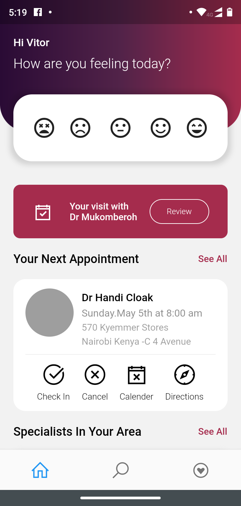

# Flutter Health Care App

<p align="center">
  
  
</p>

## Getting Started

**Note:** Make sure your Flutter environment is setup.

### Installation

In the command terminal, run the following commands:
```
  $ git clone git@github.com:vitorhps/flutter-interfaces.git
  $ cd flutter-interfaces/flutter_health_care_app/
  $ flutter run
```

### Simulate for iOS

#### Method One
```
  Open the project in Xcode from ios/Runner.xcodeproj.
  Hit the play button.
```

#### Method Two
```
  Run the following command in your terminal.
  $ open -a Simulator
  $ flutter run
```

### Simulate for Android
```
  Make sure you have an Android emulator installed and running.```
  Run the following command in your terminal.
  $ flutter run
```

##### Check out Flutter’s online [documentation](http://flutter.io/) for help getting start with your Flutter project.
